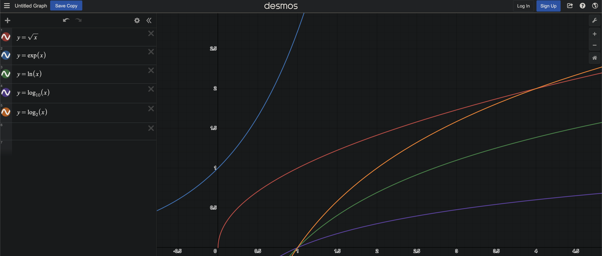

# Challenge 1: prb-math Rust library

## Overview

Create a prb-math library with a Rust smart contract.




## Requirements

Create a Solidity smart contract called: ```prbMathBlended``` which:

```
-is deployed and verified to Fluent testnet
-calls a Rust contract, which calculates the following functions in Rust 
then returns the Solidity values as type int256 (for positive and negative values):
   -sqrt(x)
   -exp(x)
   -ln(x)
   -log10(x)
   -log2(x)
```

Create a basic frontend for ```prbMathBlended``` which:

```
-integrates all functions
    -have all input arguments to input
    -return output values
```

## Resources

Fluent Blended App Solidity + Rust contracts

https://docs.fluent.xyz/developer-guides/building-a-blended-app/

prb-math in Solidity library

https://github.com/PaulRBerg/prb-math

Rust Floating Point Crate Library for WASM projects

https://crates.io/crates/libm

Desmos Graphing Calculator With Test prb-math Functions

https://www.desmos.com/calculator/5p8c3q2is2
